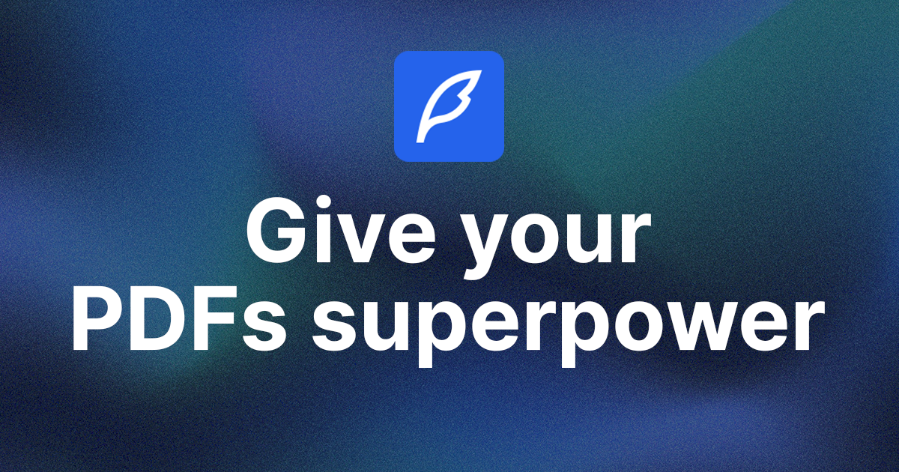

# [Ask PDF](https://ask-pdf-saifur.vercel.app)

Ask PDF allows you to have conversations with any PDF document. Simply upload your file and start asking questions right away.

[](https://ask-pdf-saifur.vercel.app)

## Tech Stack

- **Framework:** [Next.js](https://nextjs.org)
- **Styling:** [Tailwind CSS](https://tailwindcss.com)
- **Authentication:** [Auth.js](https://authjs.dev)
- **ORM:** [Drizzle ORM](https://orm.drizzle.team)
- **UI Components:** [shadcn/ui](https://ui.shadcn.com)
- **File Uploads:** [uploadthing](https://uploadthing.com)
- **Payments infrastructure:** [Stripe](https://stripe.com)

## Running Locally

1. Clone the repository

   ```bash
   git clone https://github.com/devSaifur/ask-pdf.git
   ```

2. Install dependencies using pnpm

   ```bash
   pnpm install
   ```

3. Copy the `.env.example` to `.env` and update the variables.

   ```bash
   cp .env.example .env
   ```

4. Start the development server

   ```bash
   pnpm run dev
   ```

5. Push the database schema

   ```bash
   pnpm run db:push
   ```

6. Start the development server

   ```bash
   pnpm run dev
   ```
